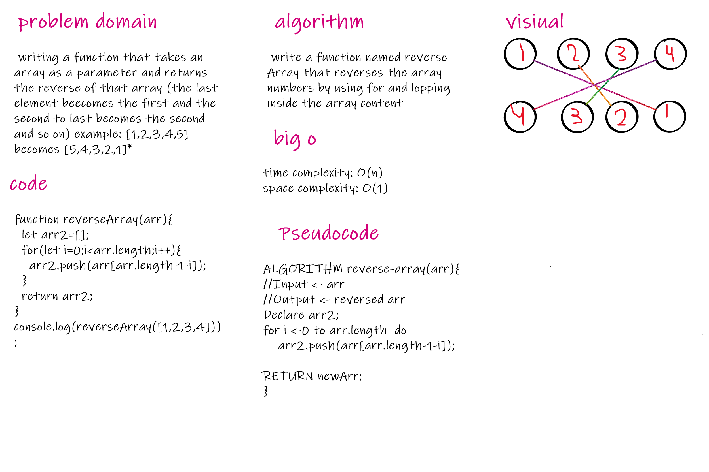

# Reverse an Array
* writing a function that takes an array as a parameter and returns the reverse of that array (the last element beecomes the first and the second to last becomes the second and so on) example: [1,2,3,4,5] becomes [5,4,3,2,1]* 

* Challenge
achieving this without using built in functions

* Approach & Efficiency  
1- understand the problem 
2- plan the solution 
3- Divide the challenge into several smaller issues

* Solution

