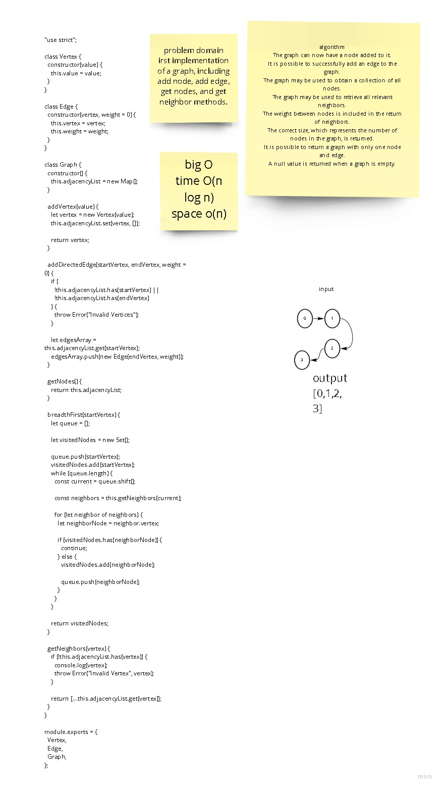

# Graphs
<!-- Short summary or background information -->
irst implementation of a graph, including add node, add edge, get nodes, and get neighbor methods.
## Challenge
The graph should be represented as an adjacency list,

## Approach & Efficiency
<!-- What approach did you take? Why? What is the Big O space/time for this approach? -->

## API
add(value) ---> Returns: The added node and Add a node to the graph.

addEdge(start, end, weight) ---> Returns: nothing, and Adds a new edge between two nodes in the graph If specified, assign a weight to the edge

getNodes ---> Returns all of the nodes in the graph as a collection (set, list, or similar)

getNeighbors ---> Returns a collection of edges connected to the given node, Include the weight of the connection in the returned collection.

size ---> Returns the total number of nodes in the graph.

breadthFirst(vertex) ---> Returns values traversed in Breadth First approach.

