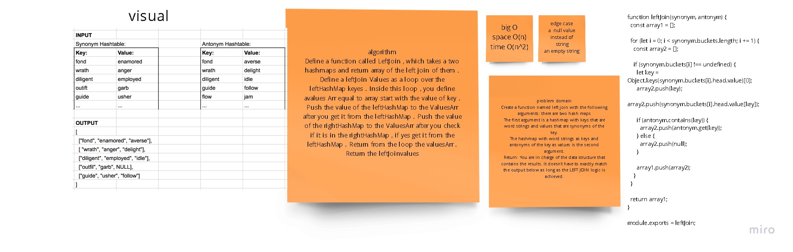

# Hashmap LEFT JOIN
<!-- Short summary or background information -->

Implement a simplified LEFT JOIN for 2 Hashmaps.

## Challenge
<!-- Description of the challenge -->

   Create the left join function.
Two hash maps are used as arguments.
The first argument is a hashmap with keys that are word strings and values that are synonyms of the key.
The hashmap with word strings as keys and antonyms of the key as values is the second argument.
Return: You are in charge of the data structure that contains the results. It doesn't have to exactly match the output below as long as the LEFT JOIN logic is achieved.

## Solution
<!-- Embedded whiteboard image -->

