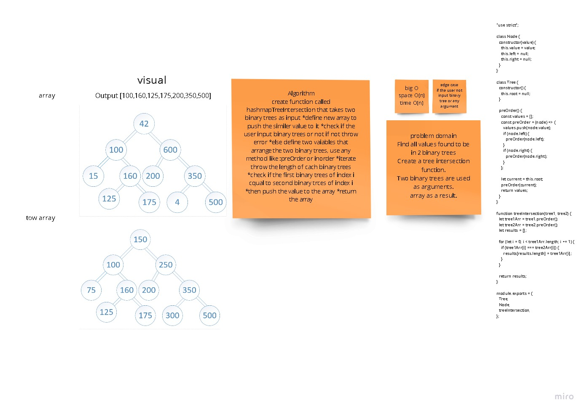

# Hashmap Tree Intersection

Find common values in 2 binary trees/Find all values found to be in 2 binary trees.

    Write a function called tree intersection
    Arguments: two binary trees
    Return: array

`Output [100,160,125,175,200,350,500]`

## Approach & Efficiency

<!-- What approach did you take? Why? What is the Big O space/time for this approach? -->

Space and time of O(1).

## Solution

<!-- Show how to run your code, and examples of it in action -->

See `hashmap-tree-intersection/tree-intersection.js` for code.

## API

<!-- Description of each method publicly available in each of your hashtable -->

`Add()`
When adding a new key/value combination to a hashtable, make the following changes:

Using the GetHash method, send the key.
Go to that index once you've determined where it should be put.
Check to see whether something already exists at that index; if not, add it using the key/value pair.
If anything already exists, add the new key/value combination to the bucket's data structure.

`Find()`
The Find function accepts a key, calculates the Hash, and navigates to the provided index position. Once the index point in the array has been discovered, the algorithm must cycle through the bucket and check if the key exists before returning the result.

`Contains()`

The Contains method will accept a key, and return a bool on if that key exists inside the hashtable. The best way to do this is to have the contains call the GetHash and check the hashtable if the key exists in the table given the index returned.

`GetHash()`

The GetHash will accept a key as a string, conduct the hash, and then return the index of the array where the key/value should be placed.
