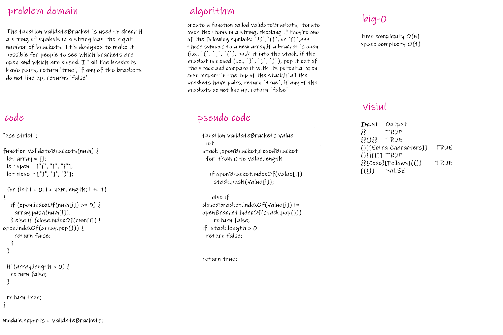

# Multi-bracket Validation

Multi-bracket Validation.

## Whiteboard Process

## Approach & Efficiency

My strategy was to produce a more detailed picture than I had previously. It was useful for me to 'define' the Animal constructor and its offspring, as well as their attributes.

## Algorithm

create a function called validateBrackets, iterate over the items in a string, checking if they're one of the following symbols: `{}`,`()`, or `[]`,add those symbols to a new array,if a bracket is open (i.e., `{`, `[`, `(`), push it into the stack, if the bracket is closed (i.e., `}`, `]`, `)`), pop it out of the stack and compare it with its potential open counterpart in the top of the stack,if all the brackets have pairs, return `true`, if any of the brackets do not line up, return `false`

https://github.com/dana-younis/data-structures-and-algorithms/pull/36