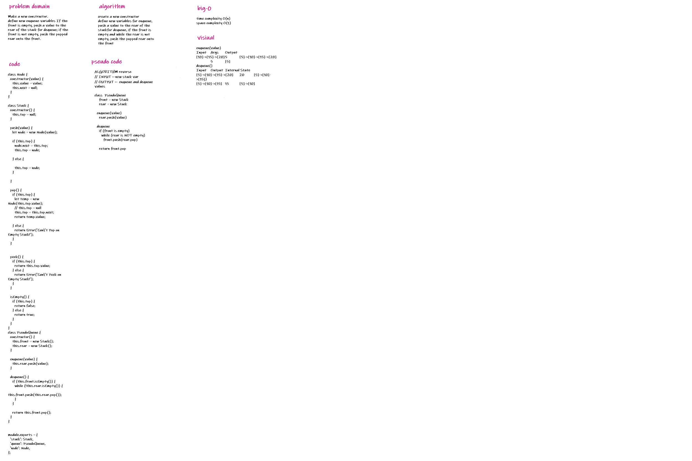

# Challenge Summary
Make a new constructor.
define new enqueue variables If the front is empty, push a value to the rear of the stack for dequeue; if the front is not empty, push the popped rear onto the front.

## Whiteboard Process

## Approach & Efficiency
I discovered this during the stacks-and-queues lecture and coding challenge. I was able to construct a step-by-step algorithm using the input/expected result shown above. It helped me envision what was expected of me.

## Solution
<!-- Show how to run your code, and examples of it in action -->
