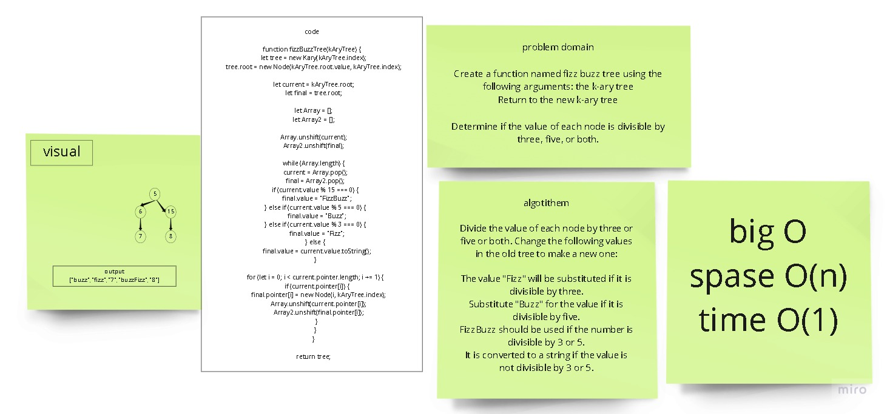

# Trees
Javascript implementation of the Trees data structure

 
Create a function named fizz buzz tree using the following arguments: the k-ary tree
Return to the new k-ary tree

## Challenge
browsing and adding in bi search trees using a recursive method

## Approach & Efficiency
approach: recursion
Efficiency:
space: O(h) for all methods where h is the height of the tree
time: O(n) for all methods where is the number of nodes

## Whiteboard Process

